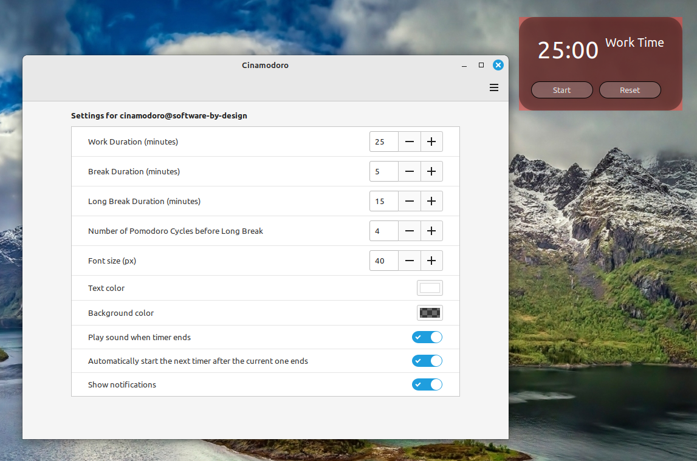

# Cinamodoro

Cinamodoro - A desklet that displays a Pomodoro timer with work/break cycles.

I built this desklet to help you stay focused by using the Pomodoro technique.

## Installation

### Installation from default desklet downloader (Recommended)
> Right-click on your desktop
> Select `Add Desklet`
> Go to "Download" tab, search `Cinamodoro` and download it.

### Installation from source (get the most recent version here)
> Go <a href="https://github.com/aSoftwareByDesignRepository/cinamodoro">here</a> and download the desklet.
> Then extract the archive and copy the `cinamodoro@software-by-design` folder into your `~/.local/share/cinnamon/desklets` folder.

## Usage

<ol>
<li>Launch the desklet</li>
<li>Right-click on the desklet and select configure..</li>
<li>Set your desired work and break durations.</li>
<li>Start the timer and focus on your tasks!</li>
</ol>

## Important

> Notice: This desklet prevents decorations for a cleaner look.

## For more info visit the official <a href="https://github.com/aSoftwareByDesignRepository/cinamodoro">site</a>  

